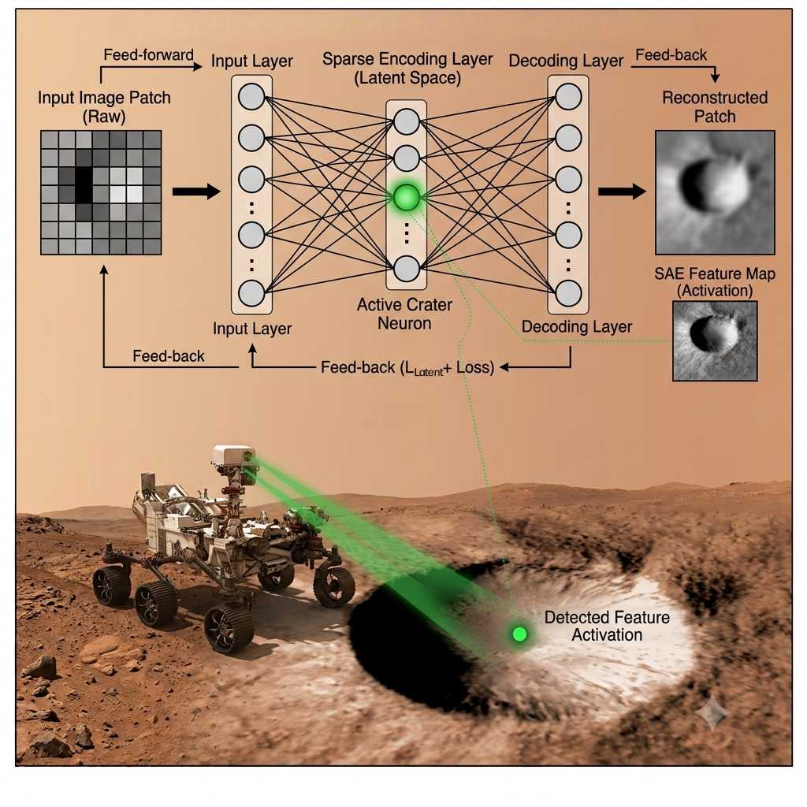
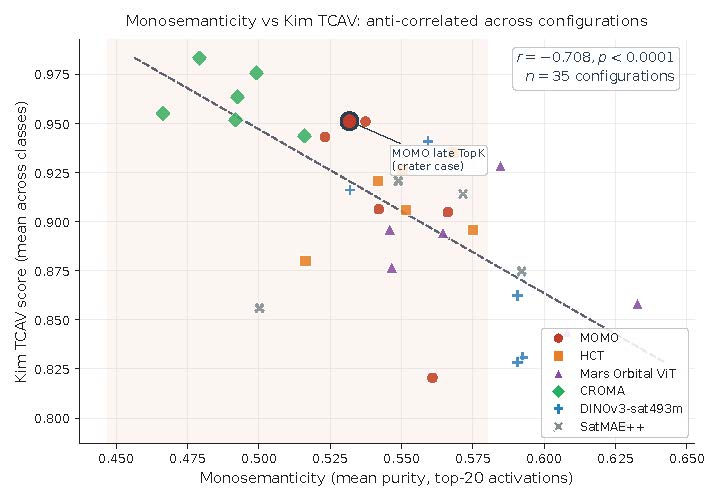
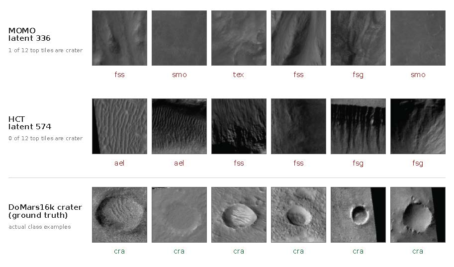
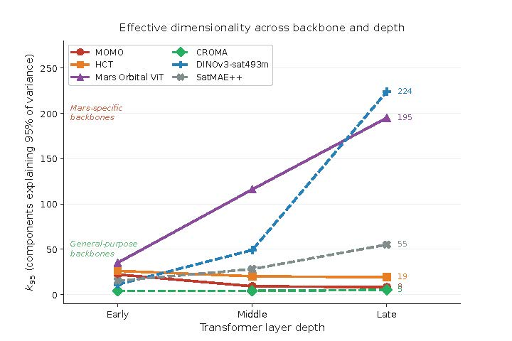

# SAE Experiments on Mars Orbital ViT Backbones

Structured sparse autoencoder (SAE) experiment pipeline across multiple pretrained ViT backbones and layer depths, using HiRISE v3.2 patch-token activations.

## Paper

This repository accompanies:

> Kacy Hatfield, Lindsay Sanneman. **"When Explanation Metrics Disagree in Planetary AI: Implications for Scientists in the Loop."** SpaceCHI 2026.

### Key results

**Monosemanticity vs. TCAV score, anti-correlated across the 36-configuration grid:**

**The crater case: the pipeline-selected latent does not resemble craters:**

**Effective dimensionality ($k_{95}$) by backbone and layer depth:**

### Full results table (all 36 configurations)

SAE quality and domain-relevance metrics for every backbone × layer × architecture combination. Layer: E = early, M = middle, L = late. Arch: Mat = Matryoshka, TopK = TopK. `N_alive` = number of non-dead latents. Mono = monosemanticity. PDA = probe-decoder alignment. TCAV Sig = significance against a 25-draw null.

> **Note:** SatMAE++ early/TopK shows anomalous explained variance (−0.028), consistent with a CUDA numerical error, and should be treated with caution.

| Backbone | Layer | Arch | EV | CosSim | ΔF1 | N_alive | Mono | PDA | TCAV Score | TCAV Sig |
|---|---|---|---|---|---|---|---|---|---|---|
| CROMA | E | Mat | 0.869 | 0.895 | -0.163 | 144 | 0.479 | 0.437 | 0.983 | 0.93 |
| CROMA | E | TopK | 0.895 | 0.908 | -0.159 | 158 | 0.499 | 0.423 | 0.976 | 0.87 |
| CROMA | M | Mat | 0.833 | 0.877 | -0.165 | 149 | 0.492 | 0.394 | 0.952 | 0.87 |
| CROMA | M | TopK | 0.815 | 0.866 | -0.148 | 161 | 0.466 | 0.403 | 0.955 | 0.87 |
| CROMA | L | Mat | 0.768 | 0.833 | -0.159 | 166 | 0.492 | 0.377 | 0.963 | 0.87 |
| CROMA | L | TopK | 0.801 | 0.839 | -0.167 | 178 | 0.516 | 0.403 | 0.944 | 0.87 |
| DINOv3-sat493m | E | Mat | 0.463 | 0.834 | -0.134 | 473 | 0.628 | 0.276 | 0.796 | 0.60 |
| DINOv3-sat493m | E | TopK | 0.803 | 0.899 | -0.151 | 455 | 0.592 | 0.323 | 0.831 | 0.67 |
| DINOv3-sat493m | M | Mat | 0.397 | 0.627 | -0.136 | 840 | 0.591 | 0.252 | 0.828 | 0.80 |
| DINOv3-sat493m | M | TopK | 0.405 | 0.638 | -0.113 | 693 | 0.591 | 0.245 | 0.862 | 0.73 |
| DINOv3-sat493m | L | Mat | 0.287 | 0.538 | -0.129 | 619 | 0.559 | 0.247 | 0.941 | 1.00 |
| DINOv3-sat493m | L | TopK | 0.278 | 0.556 | -0.118 | 668 | 0.532 | 0.272 | 0.916 | 0.93 |
| HCT | E | Mat | 0.474 | 0.739 | -0.122 | 459 | 0.550 | 0.336 | 0.926 | 0.80 |
| HCT | E | TopK | 0.589 | 0.785 | -0.115 | 441 | 0.568 | 0.359 | 0.935 | 0.87 |
| HCT | M | Mat | 0.539 | 0.757 | -0.100 | 357 | 0.516 | 0.374 | 0.880 | 0.67 |
| HCT | M | TopK | 0.504 | 0.721 | -0.126 | 306 | 0.542 | 0.368 | 0.921 | 0.80 |
| HCT | L | Mat | 0.525 | 0.726 | -0.094 | 322 | 0.551 | 0.375 | 0.906 | 0.73 |
| HCT | L | TopK | 0.424 | 0.658 | -0.098 | 317 | 0.575 | 0.379 | 0.896 | 0.67 |
| Mars Orbital ViT | E | Mat | 0.563 | 0.772 | -0.107 | 849 | 0.633 | 0.311 | 0.858 | 0.47 |
| Mars Orbital ViT | E | TopK | 0.387 | 0.691 | -0.096 | 593 | 0.608 | 0.301 | 0.843 | 0.53 |
| Mars Orbital ViT | M | Mat | 0.519 | 0.720 | -0.100 | 572 | 0.546 | 0.258 | 0.896 | 0.87 |
| Mars Orbital ViT | M | TopK | 0.555 | 0.741 | -0.093 | 469 | 0.547 | 0.292 | 0.877 | 0.87 |
| Mars Orbital ViT | L | Mat | 0.589 | 0.763 | -0.092 | 643 | 0.565 | 0.275 | 0.894 | 0.87 |
| Mars Orbital ViT | L | TopK | 0.601 | 0.769 | -0.095 | 536 | 0.585 | 0.276 | 0.928 | 1.00 |
| MOMO | E | Mat | 0.352 | 0.703 | -0.107 | 412 | 0.566 | 0.295 | 0.905 | 0.87 |
| MOMO | E | TopK | 0.509 | 0.756 | -0.101 | 363 | 0.561 | 0.318 | 0.821 | 0.53 |
| MOMO | M | Mat | 0.606 | 0.792 | -0.131 | 236 | 0.523 | 0.421 | 0.943 | 0.60 |
| MOMO | M | TopK | 0.866 | 0.930 | -0.127 | 240 | 0.537 | 0.410 | 0.951 | 0.73 |
| MOMO | L | Mat | 0.686 | 0.837 | -0.131 | 224 | 0.542 | 0.406 | 0.906 | 0.67 |
| MOMO | L | TopK | 0.664 | 0.820 | -0.124 | 247 | 0.532 | 0.397 | 0.951 | 0.87 |
| SatMAE++ | E | Mat | 0.277 | 0.671 | -0.166 | 322 | 0.500 | 0.313 | 0.856 | 0.27 |
| SatMAE++ | E | TopK | -0.028 | 0.634 | -0.179 | 350 | 0.472 | 0.356 | 0.865 | 0.53 |
| SatMAE++ | M | Mat | 0.230 | 0.613 | -0.136 | 532 | 0.592 | 0.346 | 0.875 | 0.67 |
| SatMAE++ | M | TopK | 0.018 | 0.516 | -0.148 | 433 | 0.549 | 0.324 | 0.921 | 0.87 |
| SatMAE++ | L | Mat | 0.306 | 0.593 | -0.115 | 544 | 0.572 | 0.295 | 0.914 | 0.80 |
| SatMAE++ | L | TopK | 0.319 | 0.606 | -0.119 | 517 | 0.533 | 0.281 | 0.952 | 0.93 |

Also available as CSV: [`results/summary_table.csv`](./results/summary_table.csv)

### TCAV and hyperparameter details

- All reported TCAV *p*-values use n = 25 random-concept draws (coarse Monte Carlo resolution; *p* = 0.00 means the observed score exceeded all 25 null draws).
- Every backbone-layer-architecture cell trains a TopK SAE (*k* = 40 active latents, auxiliary dead-latent *k* = d_in/2) for 50,000 AdamW steps (batch size 1024, learning rate 3×10⁻⁴). TopK dictionaries use expansion factor 1; Matryoshka dictionaries use nested sizes [d_in, 2·d_in]. Backbone width d_in is 768 for MOMO, HCT, Mars Orbital ViT, and CROMA, and 1024 for DINOv3-sat493m and SatMAE++.

---

## Backbones (6)

| Name               | Source                                            |
| ------------------ | ------------------------------------------------- |
| `momo`             | MOMO ViT-Base (Mirali33/MOMO or local checkpoint) |
| `dinov3_sat493m`   | DINOv3 ViT-L SAT-493M (timm)                      |
| `mars_orbital_vit` | Custom DINOv2-style Mars ViT (`best_backbone.pt`) |
| `prithvi_eo_2`     | Prithvi-EO-2.0-300M (HuggingFace)                 |
| `croma`            | CROMA optical encoder (antofuller/CROMA)          |
| `satmae_pp`        | SatMAE++ ViT-L FMoW-RGB (mubashir04)              |

Layer depths: `early` (L/4), `middle` (L/2), `late` (3L/4).

SAE architectures: `topk` (k=40, dict=4×d), `matryoshka` (nested d, 2d, 4d; k=40).

**Total runs:** 6 × 3 × 2 = **36** combinations.

## Data paths (no separate test folder)

You only need **one** HiRISE location:

| Variable / flag                               | Purpose                               |
| --------------------------------------------- | ------------------------------------- |
| `HIRISE_IMAGES_DIR` / `--hirise_images_dir`   | Folder with real `map-proj-v3_2` JPGs |
| `HIRISE_LABELS_FILE` / `--hirise_labels_file` | `labels-map-proj-v3_2.txt`            |

The pipeline splits that set **80% train / 20% eval** (seeded, reproducible). Eval is not a second dataset path — it is held-out images from the same files. The exact file lists are saved to `results/data_split_manifest.json`.

**No synthetic data:** corrupt images are **skipped** (logged in `results/skipped_hirise_images.json`), not replaced with black frames. Use `--strict-data` to fail instead of skip. A one-time scan caches readable paths in `results/hirise_readable_cache.json` so runs do not crash mid-extraction. Backbone weights must load from real checkpoints (no random Prithvi fallback). Prithvi expects 6 bands; HiRISE is RGB — Prithvi runs need `--allow-prithvi-rgb-proxy` if you include that backbone.

## Setup
cd SAE-Experiments
python -m venv .venv
.venv\Scripts\activate
pip install -r requirements.txt
pip install torch torchvision --index-url https://download.pytorch.org/whl/cu124

